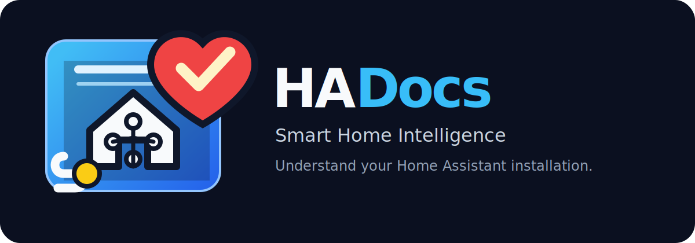
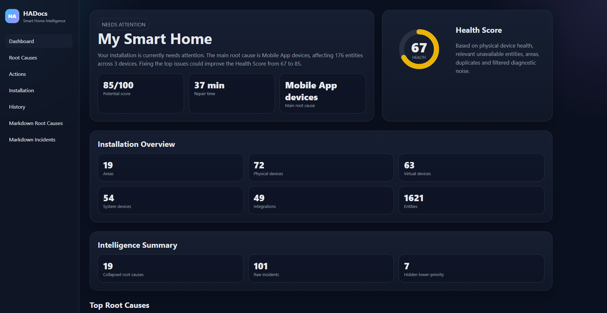
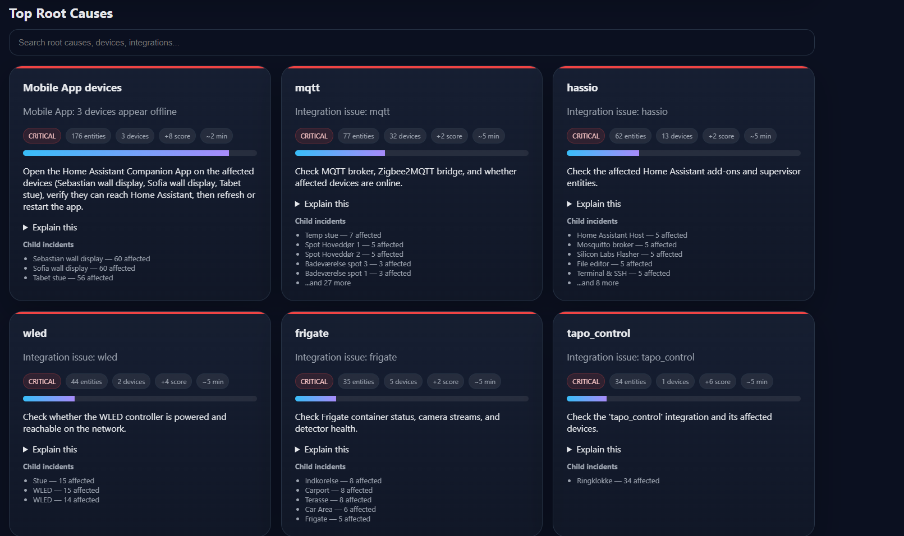
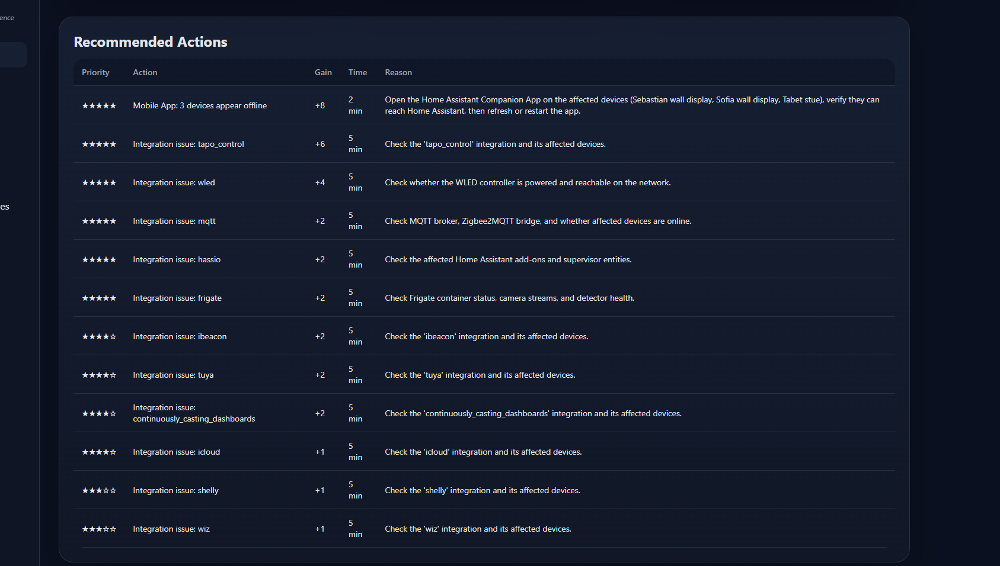
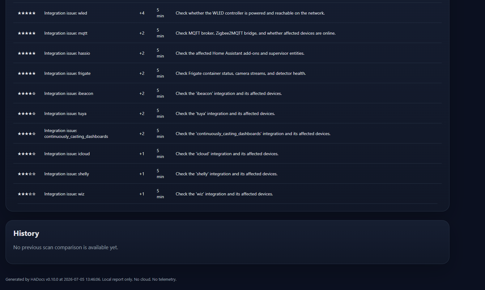

<p align="center">
  
</p>

<h1 align="center">HADocs</h1>

<p align="center">
  <strong>Smart Home Intelligence for Home Assistant</strong><br>
  Understand your Home Assistant installation.
</p>

<p align="center">
  
  
  
  
  
</p>

<p align="center">
  <strong>Local-first.</strong>
  <strong>Privacy-first.</strong>
  <strong>AI-compatible.</strong>
  <strong>Open source.</strong>
</p>

---



## What is HADocs?

HADocs is a local-first documentation and intelligence tool for Home Assistant.

It connects to your Home Assistant API, reads your installation, and generates a local dashboard, documentation, health analysis, root cause analysis and AI-compatible knowledge files.

HADocs does **not** upload your data.

HADocs does **not** call AI services.

Everything runs locally on your machine.

---

## Why HADocs?

Home Assistant can tell you that something is unavailable.

HADocs helps explain:

* what is wrong
* why it matters
* what caused it
* what to fix first
* how much impact a fix may have
* how your installation is structured

Instead of only showing:

```text
176 unavailable entities
```

HADocs tries to explain:

```text
3 Mobile App devices appear offline.
This affects 176 entities.
Estimated fix time: 2 minutes.
Potential Health Score gain: +8.
```

---

## Features

|Feature|Status|
|-|-|
|HTML Dashboard|✅|
|HTML Explorer Foundation|✅|
|Markdown Documentation|✅|
|Health Score|✅|
|Potential Score|✅|
|Root Cause Analysis|✅|
|Incident Collapse|✅|
|Recommended Actions|✅|
|Explain Engine|✅|
|Knowledge Export|✅|
|Redacted Knowledge Export|✅|
|Privacy Engine|✅|
|Local-only operation|✅|
|AI-compatible export|✅|
|AI service calls|❌|

---

## Screenshots

### Dashboard


### Root Causes



### Recommended Actions



### Explorer



---

## Generated output

After a scan, HADocs generates local files:

```text
output/
├── index.html
├── index.md
├── explorer/
│   ├── index.html
│   ├── devices.html
│   ├── integrations.html
│   ├── areas.html
│   └── entities.html
├── knowledge/
│   ├── manifest.json
│   ├── inventory.json
│   ├── health.json
│   ├── incidents.json
│   ├── recommendations.json
│   ├── relationships.json
│   ├── summary.md
│   └── redacted/
└── *.csv
```

Start with:

```text
output/index.html
```

Then open:

```text
output/explorer/index.html
```

---

## Privacy First

HADocs is built for privacy-conscious Home Assistant users.

By default:

* no cloud upload
* no telemetry
* no analytics
* no tracking
* no AI calls
* no external scripts in generated reports
* no Home Assistant write actions

Your Home Assistant data stays on your computer unless **you** choose to share it.

See:

* [`docs/PRIVACY.md`](docs/PRIVACY.md)
* [`SECURITY.md`](SECURITY.md)

---

## AI-compatible, not AI-connected

HADocs can generate structured local knowledge files that may be useful for AI assistants, local LLMs or future MCP tools.

But HADocs does **not** connect to AI providers.

This means:

```text
AI-compatible: yes
AI-connected: no
```

Compatible use cases:

* ChatGPT
* Claude
* Gemini
* Ollama
* LM Studio
* OpenWebUI
* local scripts
* future MCP servers
* HomeLab control planes

You decide what to share.

See [`docs/AI.md`](docs/AI.md).

---

## Beginner Quick Start

New users should start here:

👉 [`docs/BEGINNER\_GUIDE.md`](docs/BEGINNER_GUIDE.md)

Simple workflow:

```text
1. Download HADocs
2. Start the app
3. Enter Home Assistant URL
4. Paste Long-Lived Access Token
5. Click Generate Documentation
6. Click Open Dashboard
```

---

## Python Quick Start

```powershell
py -3.14 -m pip install -r requirements.txt
py -3.14 -m pytest
py -3.14 main.py
```

---

## Roadmap

### v0.15.x

Desktop GUI polish.

* cleaner layout
* post-scan output buttons
* auto-open dashboard
* beginner-friendly workflow

### v0.16

Explorer pages.

* individual device pages
* individual integration pages
* individual entity pages
* breadcrumbs

### v0.17

Relationship Intelligence.

* what uses this?
* can I safely delete this?
* automation relationships
* dashboard relationships

### v1.0

Smart Home Intelligence Platform.

* stable dashboard
* stable explorer
* stable knowledge export
* relationship engine
* privacy-first release

---

## Project philosophy

> Privacy First. Documentation First. Intelligence Second. AI Optional.

HADocs should help users understand their smart home without compromising privacy.

---

## Contributing

Contributions, ideas, bug reports and screenshots are welcome.

Before submitting a pull request:

```powershell
py -3.14 -m pytest
```

See [`docs/CONTRIBUTING.md`](docs/CONTRIBUTING.md).

---

## License

MIT License.

