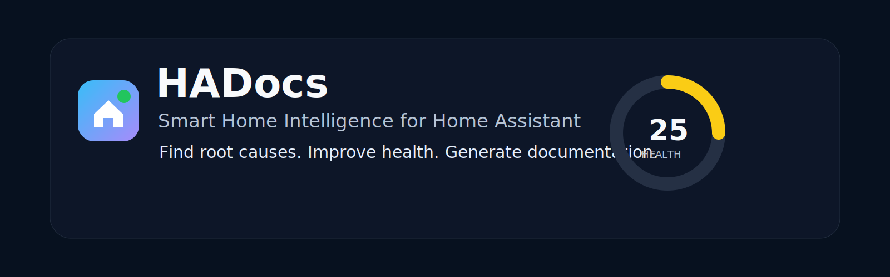
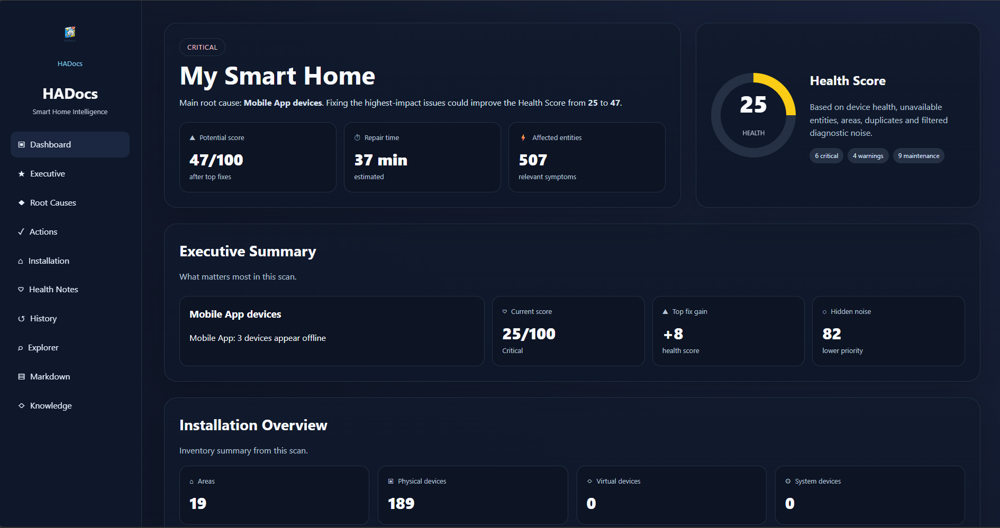
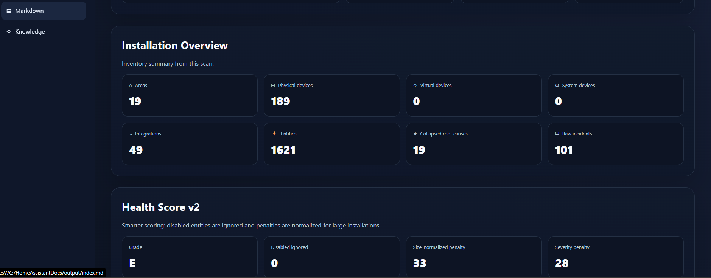
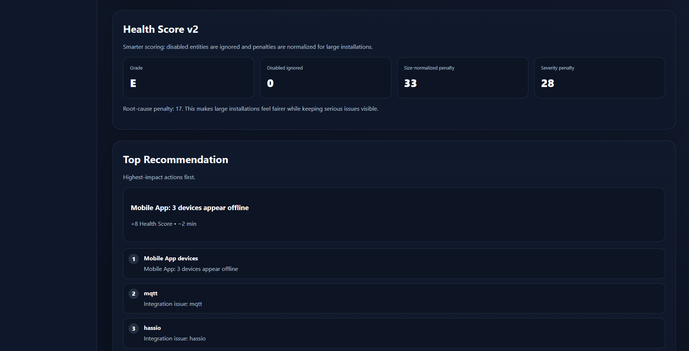
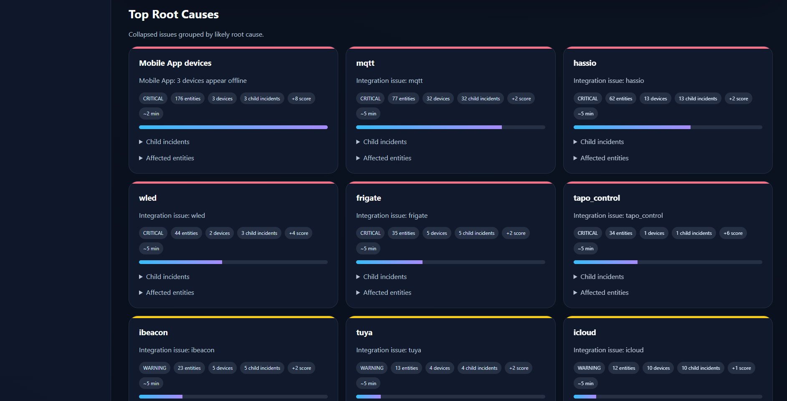
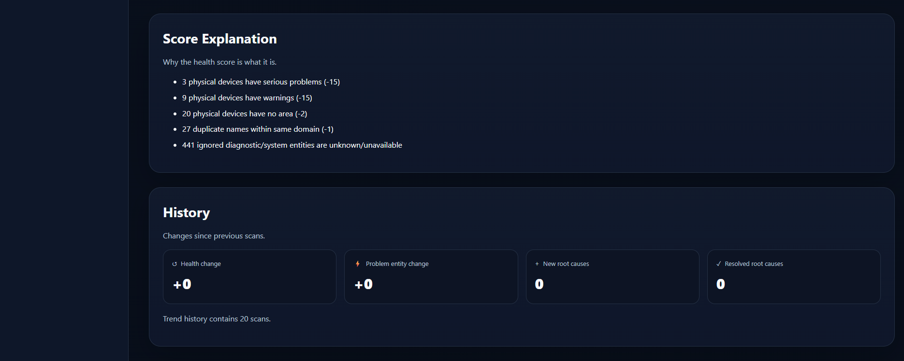
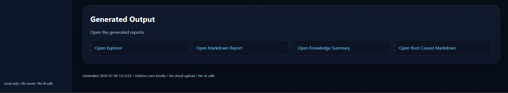

<p align="center">
  
</p>

<h1 align="center">🏠 HADocs</h1>

<p align="center">
  <strong>Smart Home Intelligence for Home Assistant</strong><br>
  <em>Find root causes. Improve health. Generate documentation.</em>
</p>

<p align="center">
  
  
  
  
  
  
  
</p>

---

## 🚀 What is HADocs?

**HADocs** is a local-first Smart Home Intelligence tool for Home Assistant.

Instead of overwhelming you with hundreds or thousands of entities, HADocs analyzes your installation, groups symptoms into **Root Causes**, calculates a transparent **Health Score**, and generates a modern intelligence dashboard.

HADocs runs locally. No cloud. No telemetry. No external AI calls.

---

## ✨ Why HADocs?

Traditional diagnostics tell you **what** is broken.

HADocs helps you understand **what to fix first**.

| Traditional tools | HADocs |
|---|---|
| Hundreds of unavailable entities | ✅ Groups symptoms into root causes |
| Raw technical data | ✅ Executive summary |
| Manual troubleshooting | ✅ Prioritized repair plan |
| Unknown impact | ✅ Health Score prediction |
| Scattered information | ✅ Dashboard, Explorer and Markdown docs |
| Hard to share safely | ✅ Local, redacted Knowledge Pack |

---

## ❤️ Dashboard Engine v2



The new Dashboard Engine gives you a product-like view of your Home Assistant installation:

- Executive Summary
- Health Score
- Potential Health Score
- Estimated repair time
- Installation Overview
- Root Cause cards
- Recommended Actions
- History
- Explorer and Knowledge Pack shortcuts

---

## ❤️ Health Score v2



Health Score v2 is designed to be explainable and fair for both small and large installations.

It considers active affected entities, critical issues, warnings, maintenance issues, root cause complexity, installation size, disabled entities and potential improvement.

Disabled entities are ignored as active problems, and penalties are normalized so large installations are not punished unfairly.

---

## ⚡ Smart Recommendations



HADocs prioritizes what matters most.

For each recommendation, HADocs can show likely root cause, affected entities, affected devices, estimated repair time, expected Health Score gain and child incidents.

Don't fix everything. Fix what matters first.

---

## 🔥 Root Cause Intelligence



HADocs focuses on causes, not symptoms.

Instead of showing 176 unavailable entities as 176 separate problems, HADocs can group them into a single Root Cause.

```text
Mobile App devices
3 devices offline
176 affected entities
Estimated repair time: 2 minutes
Potential Health Score gain: +8
```

---

## 📈 Transparent Scoring



No black box.

Health Score v2 explains why points were lost and what can improve them.

---

## 📚 Generated Output



Every scan generates a complete local intelligence package:

```text
output/
├── index.html
├── index.md
├── 00_executive_dashboard.md
├── 01_root_causes.md
├── 02_incidents.md
├── explorer/
├── knowledge/
├── history/
└── csv/
```

Generated formats include interactive HTML Dashboard, HTML Explorer, Markdown documentation, Knowledge Pack, redacted Knowledge Pack, CSV exports and history snapshots.

---

## 🔍 Explorer

The Explorer lets you browse generated data by areas, devices, entities, integrations and relationships.

---

## 🧠 Knowledge Pack

HADocs exports structured local knowledge that can be used with AI assistants manually.

HADocs does **not** upload it automatically.

You choose what to share.

```text
output/knowledge/
output/knowledge/redacted/
```

---

## 🔒 Privacy first

HADocs is built for local analysis.

- ✅ Runs locally
- ✅ No telemetry
- ✅ No cloud upload
- ✅ No external AI calls
- ✅ Home Assistant token stored in Windows Credential Manager
- ✅ `config.json` does not store tokens
- ✅ Redacted Knowledge Pack available

---

---

## 🖥️ Installation

HADocs can run in three supported ways:

1. Home Assistant Add-on
2. Docker
3. Windows

All three use the same HADocs analysis engine and web interface.

### Home Assistant Add-on

The add-on is the easiest option when HADocs should run directly inside Home Assistant.

1. Add the HADocs add-on repository to Home Assistant.
2. Install **HADocs** from the Add-on Store.
3. Configure the Home Assistant URL and Long-Lived Access Token in the add-on options.
4. Start the add-on.
5. Open the HADocs web interface from the add-on page.
6. Run a scan from **Overview**.

When a new `sirblondiedk/hadocs:dev` image has been published, rebuild or reinstall the add-on to pull the updated image.

The add-on stores persistent data in its mapped `/config`, `/cache`, and `/output` directories.

### Docker

Docker is recommended for a dedicated server, NAS, VM, or LXC host.

Create `docker-compose.yml`:

```yaml
services:
  hadocs:
    image: sirblondiedk/hadocs:dev
    container_name: hadocs

    env_file:
      - ./docker/hadocs.env

    environment:
      HADOCS_OUTPUT_DIR: /output

    volumes:
      - ./docker/output:/output
      - ./docker/cache:/cache
      - ./docker/config:/config

    ports:
      - "8099:8099"

    entrypoint: ["python", "-m", "src.hadocs.web.app"]

    restart: unless-stopped
```

Create the persistent folders:

```bash
mkdir -p docker/output docker/cache docker/config
```

Create `docker/hadocs.env` with your runtime configuration. Do not commit private tokens.

Start HADocs:

```bash
docker compose pull
docker compose up -d
```

Open:

```text
http://SERVER-IP:8099
```

View logs:

```bash
docker compose logs -f hadocs
```

Update to the newest published image:

```bash
docker compose pull
docker compose up -d --force-recreate
```

Check status:

```bash
docker compose ps
```

The container should remain **Up** because Docker starts the HADocs web application, not the one-shot `generate` command.

### Windows

The Windows release does not require a separate Python installation.

1. Download the latest Windows release from GitHub Releases.
2. Extract the ZIP archive.
3. Run `HADocs.exe`.
4. Enter the Home Assistant URL and Long-Lived Access Token.
5. Start the HADocs web interface or run a scan.
6. Open the local address shown by HADocs.

For development from source:

```powershell
git clone https://github.com/SirBlondieDK/HADocs.git
cd HADocs
py -3.14 -m pip install -e .
$env:HADOCS_OUTPUT_DIR = Join-Path (Get-Location) "output"
py -3.14 -m src.hadocs.web.app
```

---

## 🌐 Web interface

The web interface is the primary HADocs experience.

It includes:

- Overview
- Native Analysis
- Interactive Root Cause evidence
- Explorer
- Device Overrides
- Scan logs
- HTML export

The Analysis page reads directly from the HADocs data API. The generated `output/index.html` file remains available as an export and is no longer embedded as the main interface.

---

## 📦 Persistent data

HADocs uses these locations inside containers:

```text
/config
/cache
/output
```

Recommended Docker mappings:

```text
./docker/config:/config
./docker/cache:/cache
./docker/output:/output
```

Keep `docker/hadocs.env`, tokens, generated private reports, and local override files out of public commits.

---

## 🧪 Development

Run the complete test suite:

```powershell
Remove-Item Env:HADOCS_OUTPUT_DIR -ErrorAction SilentlyContinue
py -3.14 -m pytest -q
```

Start the web application:

```powershell
$env:HADOCS_OUTPUT_DIR = Join-Path (Get-Location) "output"
py -3.14 -m src.hadocs.web.app
```

Build the Docker image locally:

```bash
docker build -t hadocs:local .
```

Run the local image:

```bash
docker run --rm -p 8099:8099 \
  --env-file ./docker/hadocs.env \
  -e HADOCS_OUTPUT_DIR=/output \
  -v "$(pwd)/docker/output:/output" \
  -v "$(pwd)/docker/cache:/cache" \
  -v "$(pwd)/docker/config:/config" \
  --entrypoint python \
  hadocs:local \
  -m src.hadocs.web.app
```

---

## 🗺️ Roadmap

See [ROADMAP.md](ROADMAP.md).

Current priorities include:

- More precise evidence-based integration assessments
- Better navigation between root causes, devices, entities, and integrations
- Continued web interface polish
- Stable releases for Add-on, Docker, and Windows

---

## 🤝 Contributing

Contributions are welcome. See [CONTRIBUTING.md](CONTRIBUTING.md).

Before opening a pull request:

```powershell
Remove-Item Env:HADOCS_OUTPUT_DIR -ErrorAction SilentlyContinue
py -3.14 -m pytest -q
```

Please do not include tokens, private Home Assistant URLs, private generated reports, or local override data.

---

## ❤️ Built for the Home Assistant community

HADocs was created by a Home Assistant user to make troubleshooting faster, clearer, and more enjoyable.

If HADocs saves you time, consider giving the project a ⭐ on GitHub.
